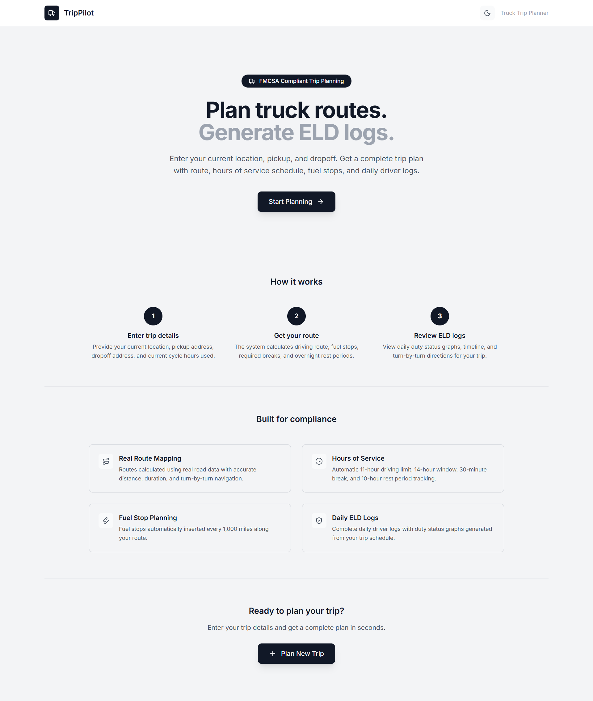
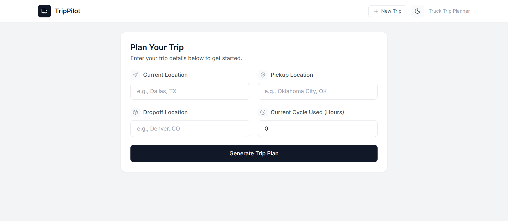
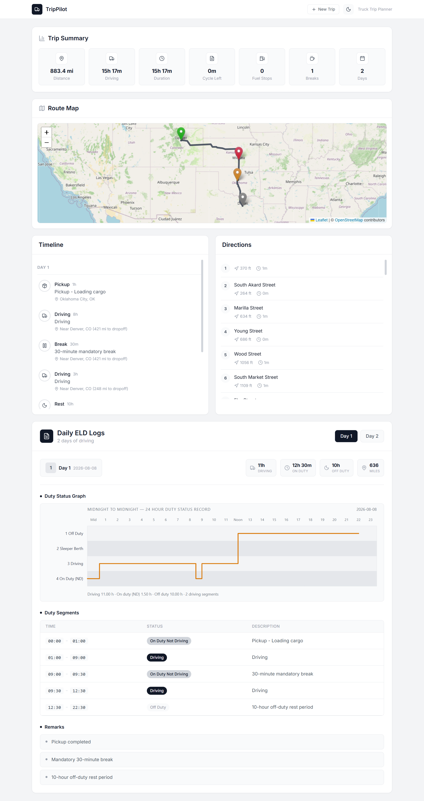

# TripPilot - Truck Trip Planner with ELD Logs

A Full Stack web application that helps truck drivers plan routes and automatically generate FMCSA-compliant ELD (Electronic Logging Device) logs. Enter your current location, pickup, and dropoff addresses along with your current cycle hours used — the app calculates the optimal route, generates a legally compliant hours-of-service schedule, and produces daily driver logs with duty status graphs.

## Screenshots

### Landing Page


### Trip Form


### Trip Results — Summary, Map, Timeline & ELD Logs


## What It Does

### 1. Route Planning
- Takes three locations: **Current Location**, **Pickup**, and **Dropoff**
- Calculates real driving routes using **OSRM** (Open Source Routing Machine) — the same engine used by many production mapping apps
- Provides turn-by-turn navigation instructions with distances and durations
- Displays the route on an interactive map with color-coded markers (grey=current, orange=pickup, green=dropoff, yellow=fuel stops, red=breaks)

### 2. Hours of Service (HOS) Scheduling
Automatically generates a driving schedule that follows **FMCSA regulations**:
- **11-hour driving limit** — cannot drive more than 11 hours without a 10-hour rest
- **14-hour driving window** — must complete driving within 14 hours of coming on duty
- **30-minute break** — mandatory break after 8 hours of cumulative driving
- **10-hour off-duty rest** — required before starting a new driving window
- **70-hour / 8-day cycle** — tracks total hours against the driver's available cycle
- Handles **multi-day trips** by automatically splitting into driving days with overnight rest periods

### 3. Fuel Stop Planning
- Calculates fuel stops every **1,000 miles** along the route
- Positions fuel stops accurately on the map using polyline interpolation

### 4. ELD Daily Logs
For each driving day, generates:
- **Duty status segments** — time blocks for Off Duty, Sleeper Berth, Driving, On Duty (Not Driving)
- **SVG duty status graph** — a 24-hour visual graph matching the FMCSA ELD grid format with CSS custom properties for light/dark theme support
- **Daily summaries** — driving hours, on-duty hours, off-duty hours, trip miles, remaining cycle hours
- **Remarks** — auto-generated notes for pickup, dropoff, fuel stops, breaks, and rest periods

### 5. Trip Summary
Displays key metrics:
- Total distance (miles)
- Total driving hours
- Trip duration
- Remaining cycle hours
- Number of fuel stops
- Number of required breaks
- Number of trip days

### 6. Timeline View
A chronological timeline of all events grouped by day, showing driving segments, fuel stops, breaks, rest periods, pickup, and dropoff.

## Tech Stack

| Layer | Technology |
|-------|-----------|
| **Backend** | Python 3.12+, Django 4.2, Django REST Framework |
| **Routing** | OSRM (Open Source Routing Machine) |
| **Geocoding** | Nominatim (OpenStreetMap) |
| **Frontend** | React 18, TypeScript, Vite |
| **Styling** | Tailwind CSS with CSS custom properties for theming |
| **Map** | React Leaflet |
| **Forms** | React Hook Form |
| **Data Fetching** | TanStack Query + Axios |
| **Icons** | Lucide React |

## API

### POST /api/trip/

**Request:**
```json
{
  "current_location": "Dallas, TX",
  "pickup_location": "Oklahoma City, OK",
  "dropoff_location": "Denver, CO",
  "current_cycle_used": 42
}
```

**Response:**
```json
{
  "summary": {
    "distance_miles": 794.82,
    "driving_hours": 13.25,
    "trip_duration_hours": 16.58,
    "remaining_cycle_hours": 14.75,
    "fuel_stops": 0,
    "break_stops": 2,
    "trip_days": 2
  },
  "route": {
    "polyline": [{"latitude": 32.7767, "longitude": -96.7970}, ...],
    "markers": [...],
    "instructions": [...],
    "bounds": {...}
  },
  "timeline": [...],
  "daily_logs": [
    {
      "day": 1,
      "date": "2026-08-08",
      "summary": {"driving_hours": 6.5, "on_duty_hours": 8.0, "off_duty_hours": 16.0, "trip_miles": 397.41, "remaining_cycle_hours": 21.5},
      "duty_segments": [...],
      "remarks": ["Pickup completed", "Mandatory 30-minute break"],
      "svg": "<svg xmlns='http://www.w3.org/2000/svg' ...>...</svg>"
    }
  ],
  "trip_days": [...]
}
```

### GET /api/health/

Returns service health status:
```json
{
  "status": "ok",
  "checks": {
    "api": "ok",
    "osrm": "ok",
    "nominatim": "ok"
  }
}
```

## Setup

### Backend

```bash
cd backend
python -m venv venv
source venv/bin/activate  # On Windows: venv\Scripts\activate
pip install -r requirements.txt
python manage.py runserver
```

Backend runs on `http://localhost:8000`

### Frontend

```bash
cd frontend
npm install
npm run dev
```

Frontend runs on `http://localhost:5173` and proxies `/api` requests to the backend.

## Environment Variables

### Backend
| Variable | Required | Default | Description |
|----------|----------|---------|-------------|
| `SECRET_KEY` | Yes (production) | dev key | Django secret key |
| `DEBUG` | No | `True` | Debug mode |
| `ALLOWED_HOSTS` | No | `localhost,127.0.0.1` | Comma-separated allowed hosts |
| `CORS_ALLOWED_ORIGINS` | No | `http://localhost:5173` | Comma-separated frontend origins |
| `ROUTING_API_KEY` | No | — | OpenRouteService key (uses OSRM by default) |
| `TZ` | No | `UTC` | Server timezone |

### Frontend
| Variable | Required | Default | Description |
|----------|----------|---------|-------------|
| `VITE_API_BASE_URL` | No | `http://localhost:8000` | Backend API URL |

## Assessment Assumptions

- Property-carrying driver
- 70 Hours / 8 Days cycle
- No adverse driving conditions
- Fuel every 1,000 miles
- Pickup requires 1 hour
- Dropoff requires 1 hour

## Deployment

### Backend (Railway)
1. Push to GitHub
2. Go to [railway.app](https://railway.app) → Login with GitHub
3. Click **New Project** → **Deploy from GitHub repo** → Select your repo → Select `backend` folder
4. Railway auto-detects Python. Go to **Settings** → **Networking** → Generate a public domain
5. Go to **Variables** and add:
   - `SECRET_KEY` = (click "Generate" or enter a long random string)
   - `DEBUG` = `False`
   - `ALLOWED_HOSTS` = `trippilot-backend.up.railway.app`
   - `CORS_ALLOWED_ORIGINS` = `https://your-project.vercel.app,http://localhost:5173`
6. Deploy automatically triggers. Check logs for errors.

### Frontend (Vercel)
1. Push to GitHub
2. Go to [vercel.com](https://vercel.com) → Login with GitHub
3. Click **Add New Project** → Import your repo → Framework: **Vite**
4. Set environment variable:
   - `VITE_API_BASE_URL` = `https://trippilot-backend.up.railway.app`
5. Deploy. Vercel auto-builds and gives you a `.vercel.app` URL.
6. After first deploy, go to **Settings → Domains** to add a custom domain if needed.

### After Both Deploy
1. Update `CORS_ALLOWED_ORIGINS` on Railway with your actual Vercel URL
2. Update `vercel.json` rewrite destination with your actual Railway URL
3. Redeploy both

## Project Structure

```
TripPilot/
├── backend/
│   ├── manage.py
│   ├── requirements.txt
│   ├── config/
│   │   ├── settings.py          # Django settings, env validation, CORS, throttling
│   │   ├── urls.py              # URL routing with 404 logging
│   │   ├── wsgi.py
│   │   └── asgi.py
│   └── apps/
│       └── trip/
│           ├── views.py         # API views with rate limiting
│           ├── serializers.py   # Input validation
│           ├── urls.py
│           └── services/
│               ├── geocoding_service.py   # Nominatim geocoding with retry
│               ├── routing_service.py     # OSRM routing with retry
│               ├── hos_engine.py          # FMCSA HOS scheduling
│               ├── fuel_engine.py         # Fuel stop calculation
│               ├── scheduler.py           # Main orchestrator
│               ├── timeline_generator.py  # Event timeline
│               └── eld_generator.py       # ELD log + SVG generation
├── frontend/
│   ├── src/
│   │   ├── api/tripApi.ts       # API client
│   │   ├── types/trip.ts        # TypeScript interfaces
│   │   ├── hooks/useTrip.ts     # React Query mutation
│   │   ├── contexts/ThemeContext.tsx  # Dark/light theme
│   │   ├── utils/
│   │   │   ├── sanitize.ts      # SVG XSS protection
│   │   │   └── formatters.ts    # Distance/time formatting
│   │   ├── components/
│   │   │   ├── TripForm/        # Input form
│   │   │   ├── Summary/         # Trip summary cards
│   │   │   ├── Map/             # Route map + instructions
│   │   │   ├── Timeline/        # Event timeline
│   │   │   ├── DailyLogs/       # ELD logs + SVG graphs
│   │   │   └── Common/          # Loading, Error, ErrorBoundary
│   │   ├── pages/
│   │   │   ├── LandingPage.tsx  # Marketing landing page
│   │   │   └── PlanPage.tsx     # Trip planner wizard
│   │   └── layouts/
│   │       └── MainLayout.tsx   # Header with theme toggle
│   └── package.json
├── vercel.json          # Vercel deployment config
├── render.yaml          # Render deployment config (alternative)
└── README.md
```
